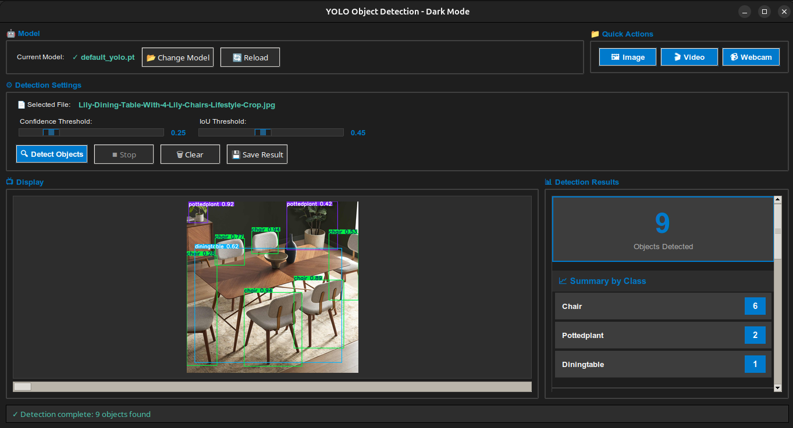

# YOLO Object Detection - Pascal VOC Fine-tuned Model

A complete object detection system using YOLOv8 fine-tuned on the Pascal VOC dataset, with a user-friendly desktop application for real-time detection on images and videos.



## 📋 Table of Contents

- [Overview](#overview)
- [Dataset](#dataset)
- [Model Training](#model-training)
- [Desktop Application](#desktop-application)
- [Installation](#installation)
- [Usage](#usage)
- [Results](#results)
- [Project Structure](#project-structure)
- [Using Your Own YOLO Model](#Using-Your-Own-YOLO-Model)  <--- IMPORTANT

---

## 🎯 Overview

This project implements an object detection system capable of detecting 20 different object classes in images and videos. The system uses YOLOv8 (You Only Look Once) architecture, fine-tuned on the Pascal VOC 2012 dataset, and includes a modern dark-themed desktop application for easy inference.

**Key Features:**
- ✅ 20 object classes detection
- ✅ Real-time video and webcam support
- ✅ High accuracy (68.8% mAP50)
- ✅ User-friendly GUI with dark mode
- ✅ Adjustable confidence thresholds
- ✅ Detailed detection statistics

---

## 📊 Dataset

### Pascal VOC 2012

The **PASCAL Visual Object Classes (VOC) 2012** dataset is one of the most widely used benchmarks in computer vision for object detection and segmentation tasks.

**Dataset Statistics:**
- **Training Images:** ~5,717 images
- **Validation Images:** ~5,823 images
- **Test Images:** ~10,991 images
- **Total Annotations:** ~27,450 objects
- **Object Classes:** 20 categories

**20 Object Classes:**

| Category | Classes |
|----------|---------|
| **Vehicles** | aeroplane, bicycle, boat, bus, car, motorbike, train |
| **Animals** | bird, cat, cow, dog, horse, sheep |
| **Indoor Objects** | bottle, chair, diningtable, pottedplant, sofa, tvmonitor |
| **Person** | person |

**Dataset Source:**
- Official Website: http://host.robots.ox.ac.uk/pascal/VOC/
- Kaggle: https://www.kaggle.com/datasets/huanghanchina/pascal-voc-2012

**Why Pascal VOC?**
- ✅ Well-balanced dataset with diverse scenes
- ✅ High-quality manual annotations
- ✅ Standard benchmark for comparing models
- ✅ Real-world object scenarios
- ✅ Multiple objects per image with occlusions

---

## 🤖 Model Training

### YOLOv8 Architecture

**YOLO (You Only Look Once)** is a state-of-the-art, real-time object detection algorithm. YOLOv8 is the latest version with improved accuracy and speed.

**Model Specifications:**
- **Architecture:** YOLOv8n (Nano)
- **Input Size:** 640×640 pixels
- **Parameters:** ~3 million
- **Model Size:** 6.2 MB
- **Framework:** PyTorch

### Fine-tuning Process

**Training Configuration:**
```
Model: YOLOv8n (Nano)
Epochs: 100
Batch Size: 16
Image Size: 640×640
Optimizer: SGD
Learning Rate: 0.01
Device: Tesla T4 GPU (Kaggle)
Training Time: 2.45 hours
```

**Training Pipeline:**
1. **Data Preparation**
   - Converted Pascal VOC XML annotations to YOLO format
   - Split into train/validation sets
   - Applied data augmentation (flip, scale, HSV adjustments)

2. **Model Initialization**
   - Loaded pre-trained YOLOv8n weights
   - Configured for 20 Pascal VOC classes

3. **Training**
   - Trained for 100 epochs on Kaggle GPU
   - Used early stopping (patience=50)
   - Monitored mAP50 and loss metrics

4. **Validation**
   - Evaluated on validation set
   - Generated confusion matrix and performance metrics

**Data Augmentation:**
- Horizontal flip: 50%
- Mosaic augmentation: 100%
- HSV color jitter
- Random scaling: ±50%
- Translation: ±10%

---

## 🖥️ Desktop Application

### Features

A modern, dark-themed desktop application built with Python Tkinter for easy object detection.

**Main Features:**
- 🎨 **Dark Mode Interface** - Easy on the eyes
- 🤖 **Dynamic Model Loading** - Switch between models on the fly
- 📷 **Multiple Input Types** - Images, videos, and webcam
- ⚙️ **Adjustable Settings** - Confidence and IoU thresholds
- 📊 **Structured Results** - Visual cards with statistics
- 💾 **Save Results** - Export annotated images

### UI Components

**1. Model Management**

- Auto-loads `models/best.pt` on startup
- Change model button for loading different models
- Reload button to refresh current model

**2. Input Options**

- 🖼️ **Image Upload** - JPG, PNG, BMP formats
- 🎬 **Video Upload** - MP4, AVI, MOV, MKV formats
- 📹 **Webcam** - Real-time detection from camera

**3. Detection Settings**

- **Confidence Threshold** (0.1-0.9): Minimum confidence for detections
- **IoU Threshold** (0.1-0.9): Non-maximum suppression threshold

**4. Results Display**

- **Total Count Card** - Large display of detected objects
- **Summary by Class** - Count badges for each class
- **Detailed Cards** - Individual detections with:
  - Confidence percentage
  - Visual confidence bar (color-coded)
  - Bounding box coordinates

**5. Action Buttons**

- 🔍 **Detect Objects** - Run detection
- ⏹ **Stop** - Stop video processing
- 🗑️ **Clear** - Reset display
- 💾 **Save Result** - Export annotated image

### Color-Coded Confidence

- 🟢 **Green** (>70%): Excellent confidence
- 🟡 **Yellow** (40-70%): Good confidence
- 🔴 **Red** (<40%): Low confidence

---

## 🚀 Installation

### Prerequisites

- Python 3.9+
- pip package manager
- Webcam (optional, for real-time detection)

---

### Step 1: Clone Repository

```bash
git clone https://github.com/drisskhattabi6/YOLO-Object-Detection.git
cd YOLO-Object-Detection
```

---

### Step 2: Create Virtual Environment (Recommended)

#### On Linux / macOS

```bash
python3 -m venv venv
source venv/bin/activate
```

#### On Windows (PowerShell)

```powershell
python -m venv venv
venv\Scripts\activate
```

Once activated, you should see `(venv)` in your terminal.

---

### Step 3: Install Dependencies

```bash
pip install -r requirements.txt
```

**Main Dependencies:**

* `ultralytics` – YOLO implementation
* `opencv-python` – Image & video processing
* `pillow` – Image handling for GUI

---

## 📖 Usage

### ▶️ Run the Application

```bash
python app.py
```

Make sure the virtual environment is activated before running the app.

### Quick Start Guide

**1. Launch Application**

- App opens with dark theme
- Model auto-loads from `models/default_yolo.pt`
- If not found, you'll be prompted to select one

**2. Load Content**

- Click **🖼️ Image** for single images
- Click **🎬 Video** for video files
- Click **📹 Webcam** for real-time detection

**3. Adjust Settings (Optional)**

- Slide **Confidence** threshold (default: 0.25)
  - Lower: More detections, less accurate
  - Higher: Fewer detections, more accurate
- Slide **IoU** threshold (default: 0.45)

**4. Run Detection**

- Click **🔍 Detect Objects**
- Wait for processing
- View results in right panel

**5. View Results**

- See total count in large card
- Check summary by class
- Review detailed detections with confidence bars

**6. Save Results (Optional)**

- Click **💾 Save Result**
- Choose location and filename
- Annotated image saved

---

## 📈 Results

### Model Performance (of the default model (the fine-tuned model)) 

**Overall Metrics:**
- **mAP50:** 68.77%
- **mAP50-95:** 49.46%
- **Precision:** 75.10%
- **Recall:** 62.25%

**Note:** you can test you owne Model

---

## 📁 Project Structure

**Current Structure:**

```
YOLODetectorApp/
├── app.py                          # Main Tkinter application
├── models/
│   └── default_yolo.pt             # Trained YOLO model
├── notebooks/
│   └── yolo-fine-tuning-on-pascal-voc-dataset.ipynb
│                                   # Model training & fine-tuning notebook
├── test_images/
│   ├── # Images for testing detection
├── README.md
├── requirements.txt
└── venv/                           # Virtual environment (not tracked in git)
```

---

## 🔧 Configuration

### Model Settings

To use a different model:
1. Place `.pt` file in `models/` folder
2. Click "📂 Change Model" in app
3. Select your model file

### Detection Parameters

Adjust in the application:
- **Confidence:** 0.1 to 0.9 (default: 0.25)
- **IoU:** 0.1 to 0.9 (default: 0.45)

---

## 🐛 Troubleshooting

**Issue: Too many false detections**

- Solution: Increase confidence threshold (0.4-0.6)

**Issue: Missing detections**

- Solution: Lower confidence threshold (0.15-0.25)

**Issue: Webcam not working**

- Solution: Check camera permissions
- Try different camera index in code

---

## 🔄 Using Your Own YOLO Model

This application is **not limited to a single YOLO model**.  
You can use it to **test, validate, and visualize predictions** from **any Ultralytics YOLO `.pt` model**.

---

### ❓ Can I use a different YOLO version?

✅ **YES**, as long as the model is in **Ultralytics `.pt` format**

Supported:
- YOLOv5
- YOLOv8
- YOLOv9
- YOLOv10
- YOLOv11

Not supported directly:
- YOLOv3 / YOLOv4 (Darknet format)

---

### ❓ Can I use another model trained on the same dataset (Pascal VOC)?

✅ **YES — fully compatible**

You can use:
- Different model sizes (nano, small, medium, large)
- Different training runs or checkpoints
- Different epochs or hyperparameters

No changes are required.

---

### ❓ Can I use a model trained on a different dataset (COCO or custom)?

✅ **YES — no code changes needed**

- The app **automatically reads class names from the model file**
- Works with:
  - COCO (80 classes)
  - Pascal VOC (20 classes)
  - Custom datasets (any number of classes)

ℹ️ The `voc_classes` list in the code is **for documentation only** and is **not used during inference**.

---

### ✅ Summary

This app is **fully dynamic**.  
When you load a `.pt` model, the application will automatically:

- Detect the number of classes
- Detect class names
- Display predictions correctly

**Examples:**
- COCO model → displays 80 classes (person, car, dog, etc.)
- Custom 5-class model → displays your 5 custom classes
- Pascal VOC model → displays 20 VOC classes


---

## 📚 References

- YOLOv8 Documentation: https://docs.ultralytics.com/
- Pascal VOC Dataset: http://host.robots.ox.ac.uk/pascal/VOC/
- YOLO Paper: https://arxiv.org/abs/1506.02640

---

## 📄 License

This project is provided for educational purposes.

---

## 🙏 Acknowledgments

- **Ultralytics** for YOLOv8 implementation
- **Pascal VOC** for the dataset
- **Kaggle** for free GPU resources
- **OpenCV** and **Pillow** for image processing
